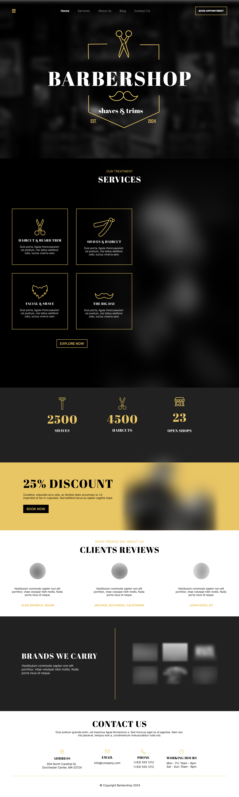

# Barber Premium System

Microsite premium para uma barbearia moderna, com visual dark editorial, navegacao multipagina e foco em experiencia, fidelizacao e contato rapido.



## Sobre

Este projeto representa a camada publica de uma barbearia premium.

Ele foi pensado para transmitir:

- identidade visual forte
- navegacao fluida entre paginas
- apresentacao elegante dos modulos principais
- area de login demonstrativa
- pagina de fidelidade
- contato direto por WhatsApp

## Preview das paginas

| Pagina | Descricao |
| --- | --- |
| `index.html` | Home com hero, modulos e jornada principal |
| `modules.html` | Visao geral dos recursos e areas do sistema |
| `login.html` | Tela publica de acesso do cliente |
| `fidelidade.html` | Programa de fidelidade com progresso visual |
| `studio.html` | Direcao visual e atmosfera da marca |
| `contact.html` | Contato, horarios e atendimento |

## Estrutura

```text
barber-premium-public/
├─ assets/
│  ├─ css/
│  │  └─ public-site.css
│  └─ images/
│     ├─ barber-premium-logo.svg
│     ├─ brands-shelf.png
│     ├─ clients-portraits.png
│     ├─ hero-barbershop.png
│     ├─ preview-homepage.png
│     ├─ products-premium.png
│     └─ service-beard-trim.png
├─ index.html
├─ modules.html
├─ login.html
├─ fidelidade.html
├─ studio.html
├─ contact.html
└─ README.md
```

## Tecnologias

- HTML5
- CSS3
- layout responsivo
- estrutura estatica pronta para deploy

## Publicacao

Este projeto pode ser publicado facilmente em:

- GitHub Pages
- Vercel
- Netlify
- qualquer hospedagem estatica

Para rodar localmente, basta abrir `index.html` no navegador.

## Personalizacao

Antes de publicar em producao, vale ajustar:

- numero do WhatsApp nos links `wa.me`
- endereco e horarios em `contact.html`
- nome da marca
- textos institucionais
- servicos, beneficios e imagens

## Quer uma versao personalizada?

Se quiser uma versao sob medida, com novas paginas, integracoes ou fluxo mais completo, entre em contato:

- WhatsApp: `https://wa.me/SEU_NUMERO`
- E-mail: `seuemail@dominio.com`

## Licenca

Uso livre para portfolio e apresentacao comercial.
